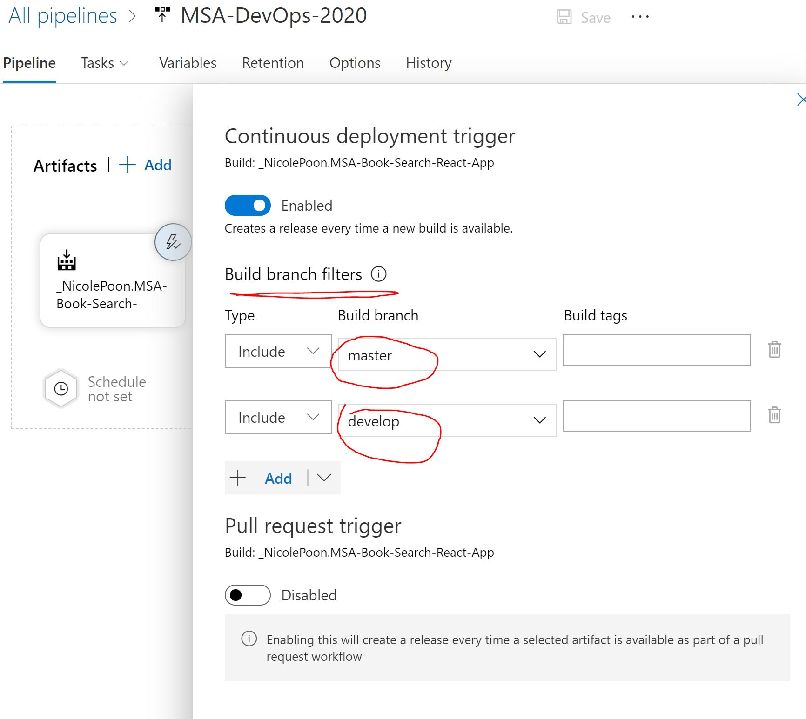
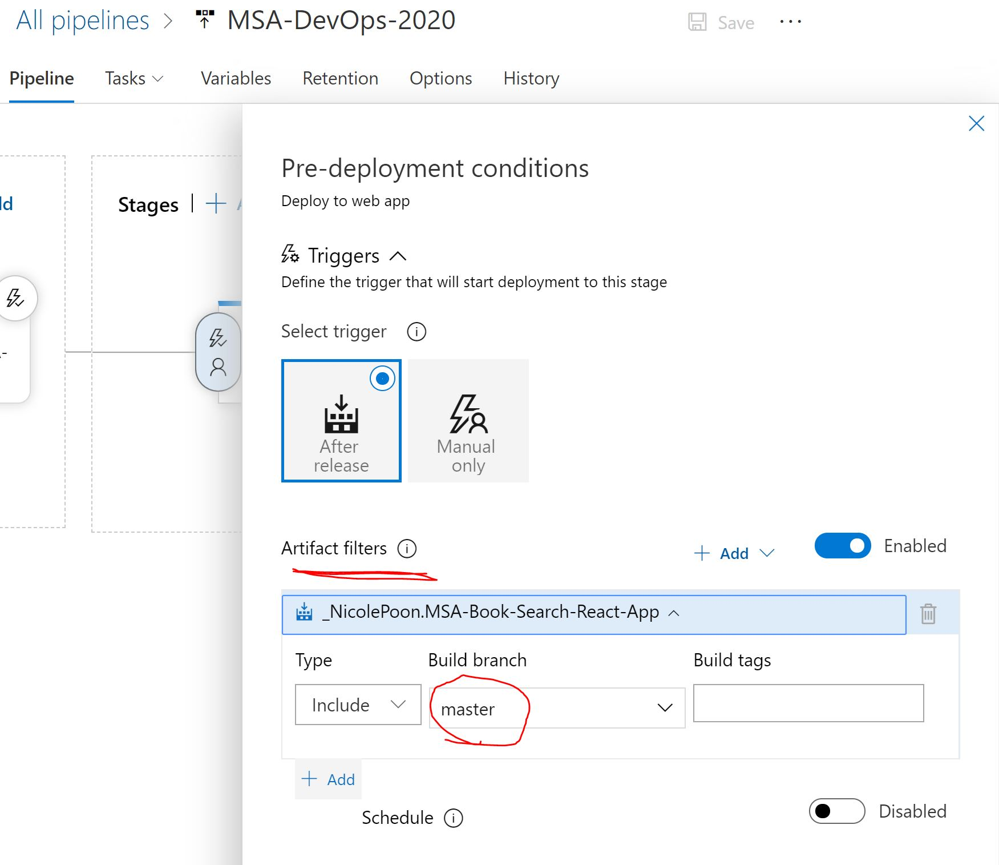
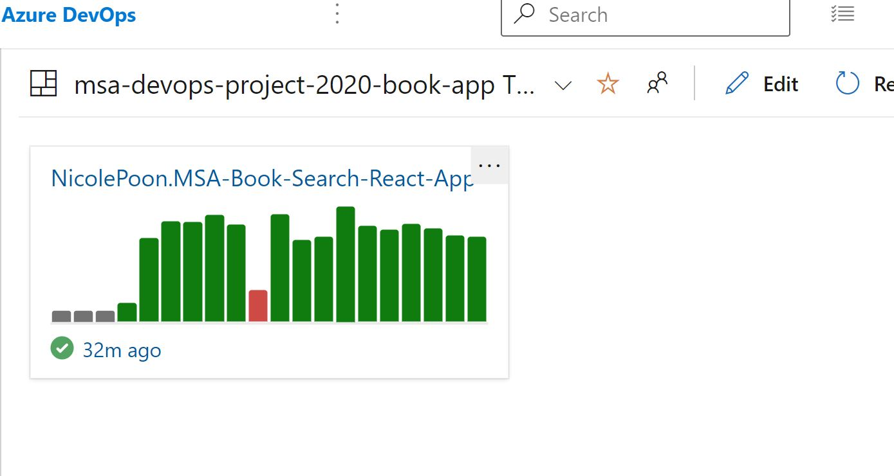

# MSA-Book-Search-React-App :books: :books: :books: :mag: :mag: 

## URL of my website

[https://msa-book-search.azurewebsites.net/](https://msa-book-search.azurewebsites.net/) 

 

## Description of build and release pipelines

* I basically follow the MSA-DevOps tutorial to set up a build pipeline and a release pipeline for my book-search App storing in GitHub.

* I enable a continuous deployment to create releases on new commits to `develop` and `master` branches via `Build branch filters`.
Please check the following screenshot.

 
 

* I enable a continuous deployment to deploy my release to Azure for new commits to `master` branch via `Artifact filters`.
Please check the following screenshot.

 
 

* I also add a `build badge` on the Readme file to make my build information available to everyone. 
*Please refer to the SVG image on top of the file.* :point_up: :point_up: :point_up: :point_up: :point_up:
 
 

* A `build history graph` is added to the build Dashboard to keep track of the build history. (More widgets can be added to the canvas.)
Please check the following screenshot.

